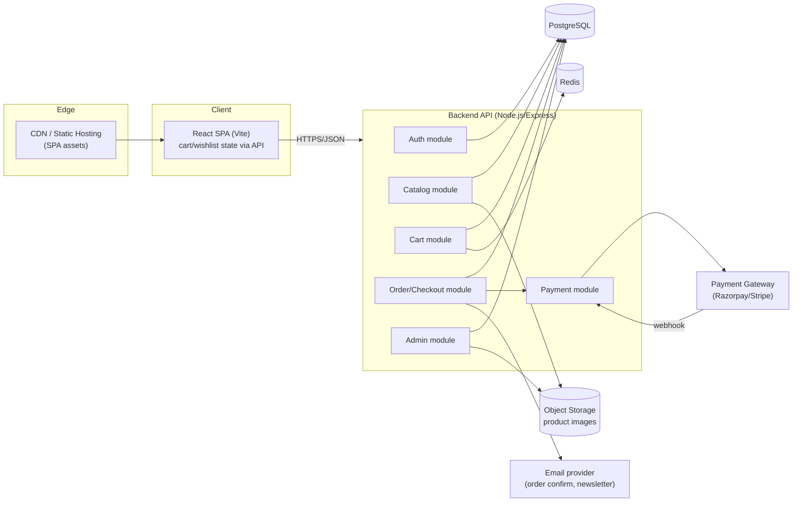
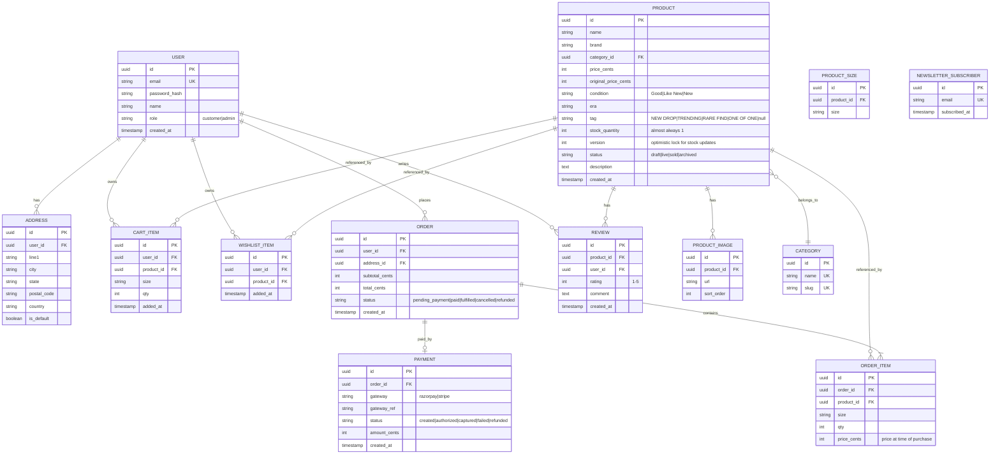
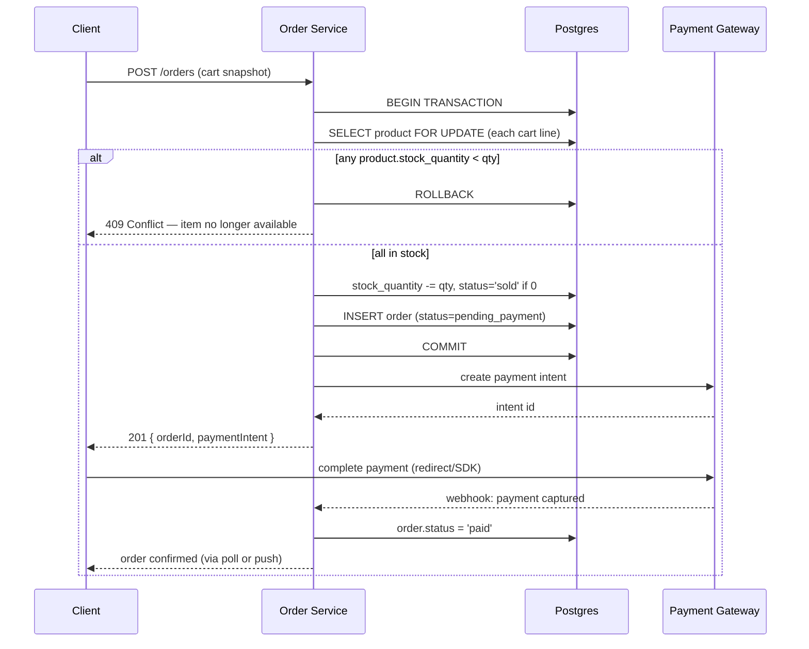

# Thrift Vault — Backend Tech Doc

Status: Draft for review before backend implementation begins.
Scope: Design the backend for the existing React/Vite storefront (`src/`). The frontend currently runs entirely client-side against a static `products.js` array with cart/wishlist persisted to `localStorage`. This doc designs the API and data layer that replaces that mock data with a real system.

## 1. Goals & Constraints

- Products are predominantly **one-of-one secondhand pieces** (stock = 1). Reselling an item that's already sold is the worst failure mode — inventory correctness under concurrent checkout is the central design constraint, not scale.
- Single-vendor/admin-curated catalog (per the "Started in a dorm room" story copy) — **not** a multi-vendor marketplace. No seller-facing auth/dashboard in v1.
- Existing UX to preserve: guest browsing, search + category filter, quick-view modal, cart drawer, wishlist drawer, toasts, newsletter signup, testimonials.
- Payment methods implied by footer (Visa, Mastercard, UPI, PayPal) → need a gateway abstraction that supports both card rails and UPI (India) — points to **Razorpay** (or Stripe + Razorpay) rather than Stripe alone.

## 2. Stack Decision

| Layer | Choice | Why |
|---|---|---|
| Runtime | Node.js + Express | Matches existing JS/React codebase; one language across the stack |
| DB | PostgreSQL | ACID transactions + row locking needed to prevent double-selling a stock=1 item; relational fits orders/inventory better than a document store |
| ORM | Prisma | Type-safe schema, migrations, works well with Express |
| Auth | JWT (access + refresh), bcrypt for passwords | Stateless API, simple to scale horizontally |
| Cache/Queue | Redis (+ BullMQ) | Session/rate-limit store now; email + abandoned-cart jobs later |
| Object storage | S3-compatible (Cloudinary or AWS S3) | Product photos, admin-uploaded |
| Payments | Razorpay (cards + UPI), Stripe as alt/international fallback | Matches footer payment icons |
| Deployment | Dockerized API + managed Postgres/Redis (Railway/Render/AWS) | Simple ops for current scale |

---

## 3. High-Level Design (HLD)

**Module boundaries** (all within one Express app initially — split into services later only if needed):

1. **Auth** — signup/login, JWT issuance/refresh, password reset.
2. **Catalog** — products, categories, search/filter, quick-view detail.
3. **Cart** — server-persisted cart per user; guest cart merges into account cart on login.
4. **Wishlist** — server-persisted saved items.
5. **Order/Checkout** — cart → order, atomic inventory hold, payment orchestration, order status.
6. **Payment** — gateway abstraction, webhook verification, refunds.
7. **Admin** — product CRUD, image upload, order fulfillment status, condition/tag management.
8. **Newsletter** — subscriber capture (footer + newsletter section already in UI).

---

## 4. Low-Level Design (LLD)

### 4.1 Data Model (ERD)

Notes:
- Money stored as integer cents to avoid float rounding errors.
- `PRODUCT.version` is an optimistic-concurrency column (Prisma `@@version` pattern) used specifically to guard the stock decrement — see §4.3.
- `PRODUCT.status` drives visibility: only `live` products with `stock_quantity > 0` appear in catalog/search results.

### 4.2 API Surface

Base path: `/api/v1`. Auth via `Authorization: Bearer <JWT>`; guest-accessible endpoints marked **public**.

| Module | Method & Path | Auth | Purpose |
|---|---|---|---|
| Auth | `POST /auth/signup` | public | Create account |
| Auth | `POST /auth/login` | public | Issue access+refresh JWT |
| Auth | `POST /auth/refresh` | public (refresh token) | Rotate access token |
| Auth | `POST /auth/logout` | user | Revoke refresh token |
| Catalog | `GET /products` | public | List + filter (`?category=`, `?q=`, `?tag=`, pagination) |
| Catalog | `GET /products/:id` | public | Product detail (quick-view/PDP) |
| Catalog | `GET /categories` | public | Category list |
| Cart | `GET /cart` | user | Get current cart |
| Cart | `POST /cart/items` | user | Add `{productId, size, qty}` |
| Cart | `PATCH /cart/items/:id` | user | Update qty |
| Cart | `DELETE /cart/items/:id` | user | Remove line |
| Cart | `POST /cart/merge` | user | Merge guest-cart payload on login |
| Wishlist | `GET /wishlist` | user | List saved items |
| Wishlist | `POST /wishlist/:productId` | user | Toggle save |
| Wishlist | `DELETE /wishlist/:productId` | user | Remove |
| Checkout | `POST /orders` | user | Create order from cart, returns payment intent |
| Checkout | `GET /orders/:id` | user | Order status |
| Checkout | `GET /orders` | user | Order history |
| Payment | `POST /payments/webhook` | gateway signature | Async payment confirmation |
| Reviews | `POST /products/:id/reviews` | user | Submit review |
| Newsletter | `POST /newsletter/subscribe` | public | Footer/newsletter form |
| Admin | `POST /admin/products` | admin | Create listing |
| Admin | `PATCH /admin/products/:id` | admin | Edit/archive listing |
| Admin | `POST /admin/products/:id/images` | admin | Upload images |
| Admin | `PATCH /admin/orders/:id` | admin | Update fulfillment status |

### 4.3 Critical Flow — Checkout with Unique Inventory

The one thing that must never happen: two customers both "win" the same one-of-one item. Handled with a DB transaction + row lock at order creation, **not** at add-to-cart (adding to cart never reserves stock, since carts can sit idle for days).

- Lock scope is per-row (`SELECT ... FOR UPDATE`), held only for the duration of the transaction — sub-100ms, so contention is a non-issue at this scale.
- If payment fails/times out after the hold, a background job (BullMQ, 15 min TTL) releases stock back (`stock_quantity += qty`, `status='live'`) and cancels the order — prevents items being stuck "reserved" forever from an abandoned checkout.

### 4.4 Auth Flow

- Passwords hashed with bcrypt (cost 12).
- Access token: 15 min TTL, JWT with `{sub, role}`.
- Refresh token: 30 day TTL, stored hashed in DB (revocable on logout).
- Admin routes gated by `role === 'admin'` middleware, separate from ownership checks.

### 4.5 Non-Functional

- **Validation**: request bodies validated with `zod` at the route boundary before hitting service logic.
- **Rate limiting**: Redis-backed limiter on `/auth/*` and `/orders` to blunt credential-stuffing and checkout abuse.
- **Idempotency**: `POST /orders` accepts an `Idempotency-Key` header so a client retry (flaky network) can't create duplicate orders.
- **Observability**: structured JSON logs per request (request id, user id, latency); errors to Sentry.
- **Migration path**: cart/wishlist already exist as `localStorage` shapes in `CartContext.jsx` — on first login, client POSTs the local `lines`/`wishlist` arrays to `/cart/merge` and `/wishlist` bulk-add, then clears localStorage as source of truth in favor of the server.

## 5. Open Questions (need answers before implementation)

1. Guest checkout — allowed without an account, or login required? (Current UI has no auth at all.)
2. Returns/exchanges — footer links to "Returns & Exchanges" but no policy or workflow defined yet.
3. Shipping — flat rate, calculated, or out of scope for v1?
4. Do we need multi-currency (UPI implies India, PayPal implies international)?
